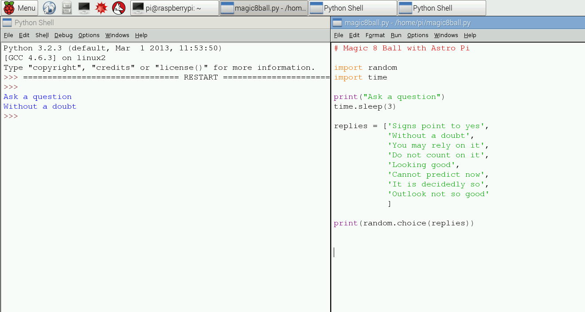
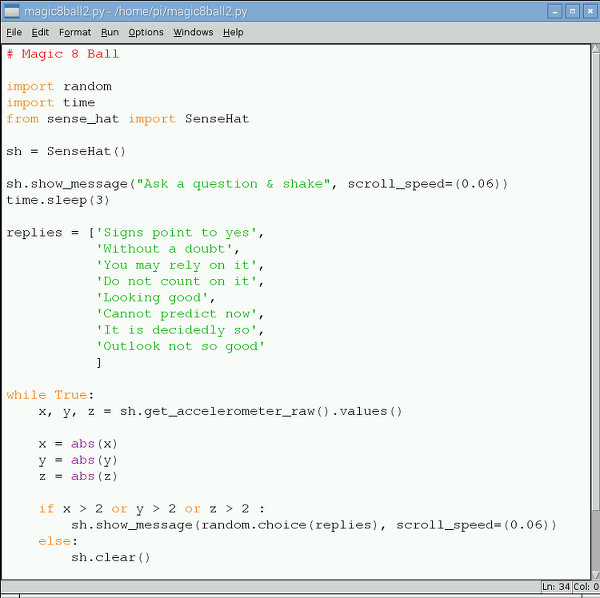

# Make a Digital Magic 8 Ball

In this activity you will build your own Magic 8 Ball using your Raspberry Pi, a Sense HAT, and some Python code. A Magic 8 Ball is a toy which you ask a closed question to, then shake, and it will give you a prediction.

In preparation for this resource, attach your Sense HAT to your Raspberry Pi by following [this guide](https://www.raspberrypi.org/learning/astro-pi-guide/assemble.md). 

## Using IDLE 3 

A great way to write your code and test it in intervals is to use IDLE 3, a development application for Python. You will be writing your code in Python 3. You will need to open IDLE 3 in a special way to be able to control your Sense HAT later on.

1. Open a Terminal window by clicking on the **Main Menu**, followed by **Accessories** and then **Terminal**.

	
	
1. Type `sudo idle3 &` and press **Enter** on the keyboard to launch IDLE 3 as the super user. This gives you super powers when running your program so that you can control your Sense HAT.	

 	

1. Once the Python shell window has loaded, click on **File** and **New Window**. This will open a text editor window in which you can write, save and test your code.

1. Save the blank file as `magic8ball.py` by clicking on **File** and **Save As**.


## Printing replies to the screen randomly

A good way to start your Magic 8 Ball program is to first create a text version of a Magic 8 Ball program. Let's think about what a Magic 8 Ball does. First you ask it a question, before shaking the ball, turning it over and then reading a reply that it has randomly chosen. Therefore, you will need a list of replies and a way of randomly choosing one from the list and displaying that answer on the screen.

1. First you need to import the `random` library and the `time` library. Type the following into your magic8ball.py text file:
	
	```python
	import random
	import time
	```
	
1. Using the `print` function you can print text to the screen, to the person using your program. Type:

	```python
	print("Ask a question")
	```
	
1. Then there needs to be a pause before the program responds with a reply, so that the user can ask a question. You can use the `time` library to ask the program to sleep for a set amount of time, like this:

	```python
	time.sleep(3)
	```
	
	The program will pause for three seconds. You can change this value to make the time longer or shorter.
	
1. Now create a list of replies that the program could give to the question. 

	*Lists can be named in much the same way as variables; for example, number = [1, 2, 3, 4]. This list called 'number' has four items in it. Your list will contain strings of text that will be displayed on the screen. These strings will be quite long.*
	
	To create your list, type:
	
	```python
	replies = ['Signs point to yes', 'Without a doubt', 'You may rely on it',]	
	```
	
	Add as many replies to your list as you like. Make sure that you separate each reply with a comma. You can break up your list onto multiple lines like this to make it easier to read, however this is not required for your program to work:
	
	
	```python
	replies = ['Signs point to yes',
			'Without a doubt',
			'You may rely on it',
			'Do not count on it',
			'Looking good',
			'Cannot predict now',
			'It is decidedly so',
			'Outlook not so good'
			]
	```
	
1. Finally, an instruction is needed to select an item from the list at random and then display it on the screen. You can use the `random` library to do this by typing:

	```python
	print(random.choice(replies))
	```
	
1. Save your code by clicking on **File** and **Save**. Then run your program to test it works by clicking on **Run** and **Run Module**. You should see a similar output to this in the IDLE 3 shell window:	
	
	 			


## Display text on an LED Matrix

Now that you have text outputting to the Python 3 shell window on your screen, let's change the code so that the text scrolls across the LED Matrix on your Sense HAT. To do this, you will need to use the Astro Pi library and replace the print functions with an Astro Pi 'show message' function.

1. Underneath the imported modules section of your code, add the following lines:

	```python
	from sense_hat import SenseHat
	sh = SenseHat()
	```

1. Next replace `print` with `sh.show_message` in your code. There are two places where you will need to do this.

1. Save your program by pressing **Ctrl + S** on your keyboard.

1. Press **F5** to run and test your program.

1. You may find that the text is slow to scroll across the LED Matrix on your Raspberry Pi. To speed up the text you can add `scroll_speed=(0.06)` to your text strings like this:

	

## Shake to start

Traditional Magic 8 Balls require the person asking a question to shake it before a reply is given. This can be simulated with a Sense HAT using the accelerometer, which measures vibrations and movement. Accelerometers can be found in most smartphones that change the direction of the screen depending on which way you hold the device.

Let's use the accelerometer on the Sense HAT to detect any change to the amount of g-force acting on each of its axes (x, y and z) before it runs the part of your program that gives a random answer to the user. 

1. First you need to create a continuous loop in your code to check the amount of the accelerometer's movement. You can use a `while True:` loop to do this. Underneath your list of replies, type:

	```python
	while True:
	    x, y, z = sh.get_accelerometer_raw().values()
	    
	    x = abs(x)
		y = abs(y)
		z = abs(z)
	``` 
	
	*Note that capital letters and indentation are very important in Python. Make sure that you use 4 spaces to indent after a `:` line.*
	
	Using `abs` converts any number into a positive number, which means that it will ignore the direction of shaking and check for the amount of shake!

1. Now it is time to set a condition in our code that checks to see if the x, y and z axes have changed (i.e. it is being moved) before it selects a random reply. If it does not detect movement then a reply will not be given.

	```python
	if x > 2 or y > 2 or z > 2 :
	    sh.show_message(random.choice(replies))
	else:
	    sh.clear()
	```      
	
	The program is checking to see if the axes of x, y and z are greater than the value 2. By changing this value you can change how sensitive the program is to movement. If you want someone to have to really shake the Raspberry Pi and Sense HAT a lot, use a higher value. 

1. Save your program by pressing **Ctrl + S** on your keyboard.

1. Press **F5** to run and test your program.

	

## What's next?

- The text is scrolling using the default colour white. Could you add some code to change the colours? See the [getting started with sense hat resource here](https://www.raspberrypi.org/learning/getting-started-with-the-sense-hat/worksheet/) to help.
- Can you create a pixel art image of a Magic 8 Ball to appear on the LED Matrix as part of the program? See [drawing shapes and patterns](https://github.com/raspberrypilearning/astro-pi-guide/blob/master/inputs-outputs/led-matrix.md) in this resource.
- Could you add sound effects to your program to make it more interesting? 
